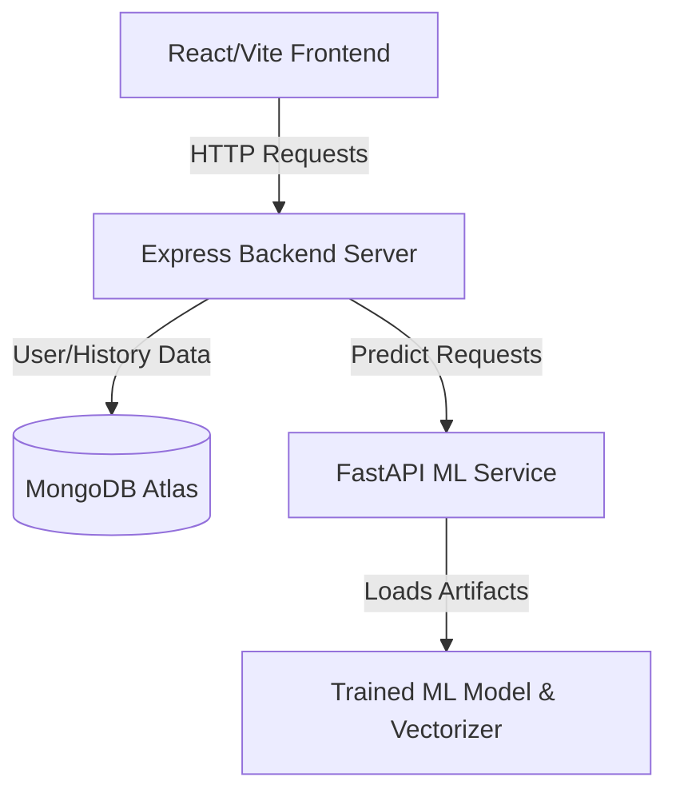

# 📰 Fake News & Misinformation Detection System

A complete, production-ready full-stack application designed to analyze and detect fake news and misinformation. The system leverages **Natural Language Processing (NLP)** and **Machine Learning (Logistic Regression)** to classify articles, providing user authentication, history tracking, feedback mechanisms, and an administrative dashboard.

---

## 🏗️ System Architecture

The application is built using a decoupled, service-oriented architecture:



1. **Frontend**: React (v19) powered by Vite, with TailwindCSS for styling and modern visual transitions.
2. **Backend**: Node.js & Express REST API managing user registration, authentication (JWT), search history, and feedback storage.
3. **ML Service**: Python FastAPI server utilizing a TF-IDF Vectorizer and a Logistic Regression model to classify inputs as **Real** or **Fake** with confidence scores.

---

## 🚀 Setup & Local Execution Guide

To run this project locally, clone the repository and follow the setup instructions for each service:

### Prerequisites
- [Node.js](https://nodejs.org/) (v16+ recommended)
- [Python](https://www.python.org/) (v3.8+ recommended)
- [MongoDB](https://www.mongodb.com/) (Local or Atlas instance)

---

### 1. 🐍 Machine Learning Service Setup

1. Navigate to the `ml-service` directory:
   ```bash
   cd ml-service
   ```

2. Create a virtual environment and activate it:
   ```bash
   # Windows
   python -m venv venv
   .\venv\Scripts\activate

   # macOS/Linux
   python3 -m venv venv
   source venv/bin/activate
   ```

3. Install the Python dependencies:
   ```bash
   pip install -r requirements.txt
   ```

4. *(Optional)* Generate sample datasets and train/evaluate the model:
   ```bash
   # Generate synthetic data
   python training/generate_sample_data.py

   # Train and serialize the model files
   python training/train_model.py
   ```

5. Launch the FastAPI server using Uvicorn:
   ```bash
   python -m uvicorn api.app:app --reload
   ```
   *The ML API will run on:* `http://127.0.0.1:8000`  
   *API Interactive Docs:* `http://127.0.0.1:8000/docs`

---

### 2. 🟢 Backend REST API Setup

1. Navigate to the `backend` directory:
   ```bash
   cd ../backend
   ```

2. Install the Node.js packages:
   ```bash
   npm install
   ```

3. Configure your environment variables in `.env` (a working pre-configured database string is included):
   ```env
   PORT=5000
   MONGO_URI=mongodb+srv://<user>:<password>@cluster0.mongodb.net/fake_news_db
   JWT_SECRET=supersecretkey123_change_this_in_production
   ML_SERVICE_URL=http://127.0.0.1:8000/predict
   FRONTEND_URL=http://localhost:5173
   ```

4. Start the backend server in development mode:
   ```bash
   npm run dev
   ```
   *The backend will run on:* `http://localhost:5000`

---

### 3. 🔵 React Frontend Setup

1. Navigate to the `frontend` directory:
   ```bash
   cd ../frontend
   ```

2. Install the Node.js packages:
   ```bash
   npm install
   ```

3. Create/verify the `.env` configuration file:

   **For Local Development:**
   ```env
   VITE_BACKEND_URL=http://localhost:5000
   VITE_ML_SERVICE_URL=http://127.0.0.1:8000
   VITE_FRONTEND_URL=http://localhost:5173
   ```

   **For Production (Vercel Deployment):**
   ```env
   VITE_BACKEND_URL=https://fake-news-and-misinformation-detect-red.vercel.app
   VITE_ML_SERVICE_URL=https://fake-news-and-misinformation-detect-swart.vercel.app
   VITE_FRONTEND_URL=https://fake-news-and-misinformation-detect.vercel.app
   ```


4. Start the Vite development server:
   ```bash
   npm run dev
   ```
   *The website will be available at:* `http://localhost:5173/`

---

## 🧪 API Validation & Verification

### Predict Endpoint (ML Service)
- **URL**: `POST http://127.0.0.1:8000/predict`
- **Request Body**:
  ```json
  {
    "title": "Breaking News",
    "text": "A charity event was held today at the local community center to raise funds."
  }
  ```
- **Example Response**:
  ```json
  {
    "prediction": "Real",
    "confidence_score": 0.9329
  }
  ```

---

## 🛠️ Tech Stack Details

| Layer | Technologies |
|---|---|
| **Frontend** | React, Vite, React Router, TailwindCSS |
| **Backend** | Node.js, Express, MongoDB Mongoose, JSON Web Tokens (JWT) |
| **Machine Learning** | Python, FastAPI, Scikit-Learn, NLTK, NumPy |

---

## 📄 License
Distributed under the ISC License. See `backend/package.json` for license info.
